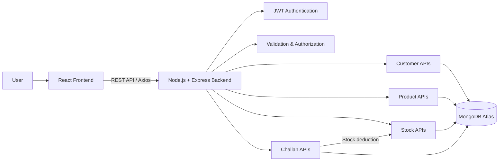

# FundsRoom Case Study

A full-stack ERP/CRM application for managing customers, products, inventory, stock movements, and sales challans.

The project has a React + TypeScript frontend and a Node.js + Express + MongoDB backend.

## Features

### Authentication

* JWT based authentication
* Role-based access
* Protected routes
* Password hashing using bcrypt
* User logout and token handling

### Customer Management

* Add and edit customers
* Customer list with pagination
* Search customers
* Filter by customer status and type
* Customer details page
* Follow-up notes

### Product Management

* Add and edit products
* Product listing
* Search and pagination
* Product stock information
* Product categories and status

### Inventory / Stock

* View stock movements
* Record stock IN and OUT movements
* Filter movements by type
* Stock quantity tracking
* Role-based access for adding stock movements

### Sales Challans

* Create sales challans
* Add multiple products to a challan
* Automatic quantity and subtotal calculation
* Customer selection
* Draft and confirmed challan status
* Challan details and product snapshots
* Stock deduction when applicable
* Prevents stock from becoming negative

## Tech Stack

### Frontend

* React
* TypeScript
* Vite
* React Router
* Axios
* React Hook Form
* CSS

### Backend

* Node.js
* Express
* TypeScript
* MongoDB
* Mongoose
* JWT
* bcrypt
* express-validator

## Application Flow



## Project Structure

```text
FundsRoom_CaseStudy/
│
├── backend/
│   ├── src/
│   │   ├── config/
│   │   ├── controllers/
│   │   ├── middleware/
│   │   ├── models/
│   │   ├── routes/
│   │   ├── db.ts
│   │   ├── app.ts
│   │   ├── server.ts
│   │   └── seed.ts
│   │
│   ├── package.json
│   ├── tsconfig.json
│   └── .env
│
└── frontend/
    ├── src/
    │   ├── components/
    │   │   ├── layout/
    │   │   └── shared/
    │   ├── context/
    │   ├── hooks/
    │   ├── pages/
    │   │   ├── auth/
    │   │   ├── dashboard/
    │   │   ├── customers/
    │   │   ├── products/
    │   │   ├── stock/
    │   │   └── challans/
    │   ├── services/
    │   ├── types/
    │   ├── App.tsx
    │   └── main.tsx
    │
    ├── package.json
    └── .env
```

## Getting Started

Clone the repository:

```bash
git clone https://github.com/rajanayakdevops/FundsRoom_CaseStudy.git
cd FundsRoom_CaseStudy
```

### Backend

Go to the backend directory:

```bash
cd backend
npm install
```

Create a `.env` file:

```env
PORT=5000
MONGODB_URI=your_mongodb_connection_string
JWT_SECRET=your_jwt_secret
FRONTEND_URL=http://localhost:5173
```

Run the backend in development:

```bash
npm run dev
```

For production:

```bash
npm run build
npm start
```

The backend will run on:

```text
http://localhost:5000
```

### Frontend

Open another terminal:

```bash
cd frontend
npm install
```

Create `.env`:

```env
VITE_API_URL=http://localhost:5000/api
```

Run the frontend:

```bash
npm run dev
```

The frontend will normally be available at:

```text
http://localhost:5173
```

## API

The backend exposes REST APIs for the main modules.

```text
/api/auth
/api/customers
/api/products
/api/stock
/api/challans
```

Authentication protected endpoints use a JWT token:

```http
Authorization: Bearer <token>
```

## Deployment

The frontend and backend can be deployed separately.

For example:

```text
React Frontend
      |
      | REST API
      v
Node / Express Backend
      |
      v
MongoDB Atlas
```

When the frontend is deployed, update:

```env
VITE_API_URL=https://your-backend-url/api
```

The backend CORS configuration should allow the deployed frontend URL.

## Roles

The application supports different user roles with access based on the responsibilities of each role.

Examples include:

* Admin
* Sales
* Warehouse
* Accounts

The sidebar and protected actions are adjusted according to the logged-in user's role.

## Database

MongoDB is used for storing application data.

Main collections/models include:

* User
* Customer
* Product
* StockMovement
* Challan

Challan records also keep product information needed for the transaction so that the sales record is not dependent only on the current product data.

## Development Notes

The frontend communicates with the backend only through REST APIs. The frontend does not directly connect to MongoDB.

JWT is used for authentication, and the token is attached to API requests through the Axios interceptor.

The backend handles validation, authorization, stock updates, and other business logic.

## Build

Frontend:

```bash
npm run build
```

Backend:

```bash
npm run build
```

The backend TypeScript files are compiled into the `dist` directory.

## Author

Raja Nayak

GitHub: https://github.com/rajanayakdevops
